# SwarmAgents-Consensus

This repository contains code for emulating SWARM agents and exploring multi-agent consensus for job selection. It leverages existing algorithms commonly used in blockchain and extends them, adding novel approaches tailored for SWARM and enhancing resilience.

## Practical Byzantine Fault Tolerance (PBFT)
PBFT algorithm is explored and implemented in `pbft_agentv2.py`. This agent works as follows:

### Design Overview

- Each agent maintains its own copy of the job queue.
- Agents work together to decide which jobs to schedule, taking into account:
  - Data dependencies of the jobs
  - Resource requirements specified for each job
  - The agent's available resources
  - Load status of neighboring agents

- Communication between agents occurs via Kafka using broadcast messaging.
- Agents share load and resource information through heartbeat messages.

#### Leader Election
Each agent strives to become the leader for executing a job based on the following conditions:

- The agent has sufficient resources to handle the job.
- The agent has access to the required data dependencies for the job.
- The agent's load is less than that of all its neighboring agents.

#### Proposal Process
- When the conditions for leadership are met, the agent sends a Proposal to all other agents in the network.
- Each Proposal includes a seed value, a random number between 0 and 1, to help resolve conflicts.
- Proposal collisions are resolved by selecting the agent with the lowest seed value.
- After sending a Proposal, the agent awaits Prepare messages indicating acceptance of its proposal.
- If a quorum of Prepare messages is received, the agent sends Commit messages to the network to indicate the leader election.
- Once a quorum of Commit messages is received, the agent finalizes the leader election, and the job is scheduled for execution.


### Performance
PBFT consensus works with smaller number of agents but struggles to scale efficiently as the number of agents increases, due to its communication complexity.
However, it's resilient and fault tolerant.

Performance results for PBFT can be found [here](./runs/pbft).


### Usage
- Set up the python environment by installing all the dependencies:
```
pip install -r requirements.txt
```
- Bring up the kafka cluster using `docker-compose up -d`
- Generates `tasks.json` via `python task_generator.py 100`
- Start Agents via following command:
```
sh pbft-start.sh
```
- Launch Log Runs
```
nohup sh launch-runs.sh runs/pbft/3/repeated 100 pbft & disown
```
- Analyze results and generate plots
```
python analyze_results.py --number_of_agents 3 --run_directory pbft/3/repeated/ --algo PBFT
```

## SWARM Consensus (Swarm)
SWARM algorithm extends PBFT consensus to the swarm topology and implemented in `swarm_agent.py`. In the first version, we have changed the leader election process as described below:

### Leader Election Process

Each agent utilizes a cost matrix to determine whether it should become the leader for executing a job by performing the following steps:

1. **Feasibility Check (`feasibility`):** Verify that the requested resources fit within the agent's total available resources.
2. **Task Cost Calculation (`cost_of_job`):** Determine the requested resources as a percentage of the agent's total resources.
3. **Agent Load Calculation (`agent_load`):** Calculate the average of in-use resources relative to the agent's total resources.
4. **Cost of Task Execution on Agent (`cost_of_job_on_agent`):** If the job is feasible, calculate it as `agent_load + feasibility * cost_of_job`; otherwise, it is set to infinite.
5. **Cost Comparison:** Compare costs across all agents for the given job.
6. **Leader Election:** If the agent with the minimum cost matches its own ID, it initiates a leader election for the job.


### Performance
#### Greedy Approach with Random seed and single job
- Greedy approach with random seed used to resolve proposal collisions shows improvement over basic PBFT.
- Job selection is triggered for only single job at a time

Performance results for SWARM with single job selection can be found [here](./runs/swarm/single-job).

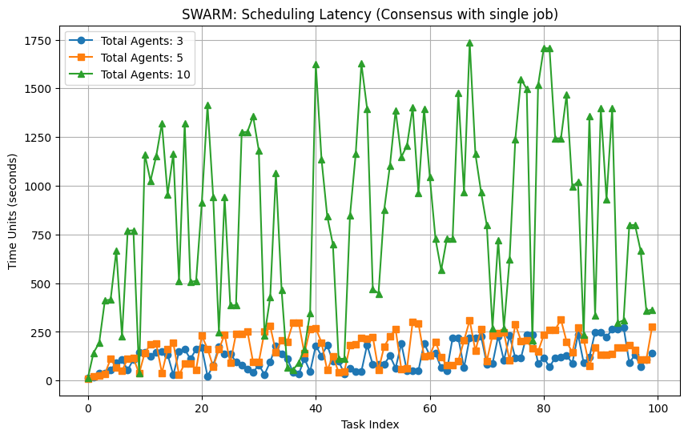

#### Greedy Approach with Random seed and multiple job
- Greedy approach with random seed used to resolve proposal collisions shows improvement over basic PBFT.
- Job selection is triggered for upto 3 jobs at a time

Performance results for SWARM with mulyiple job selection at a time can be found [here](./runs/swarm/multi-jobs).

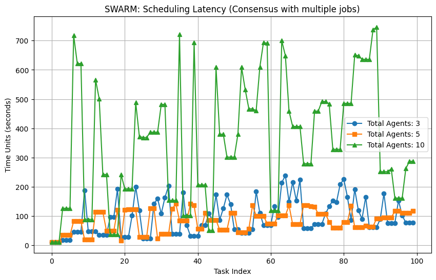

### Usage
- Set up the python environment by installing all the dependencies:
```
pip install -r requirements.txt
```
- Bring up the kafka cluster using `docker-compose up -d`
- Generates `tasks.json` via `python task_generator.py 100`
- Start Agents via following command:
  - Multi Jobs
```
sh swarm-multi-start.sh
```
  - Single Jobs
```
sh swarm-single-start.sh
```
- Launch Log Runs
  - Multi Jobs
```
  nohup sh launch-runs.sh runs/swarm/multi-jobs/3/repeated 100 swarm-multi & disown
```
  - Single Jobs
```
nohup sh launch-runs.sh runs/swarm/single-job/3/repeated 100 swarm-single & disown
```

- Analyze results and generate plots
  - Multi Jobs
```
python analyze_results.py --number_of_agents 3 --run_directory swarm/multi-jobs/3/repeated/ --algo SWARM-MULTI
```
  - Single Jobs
```
python analyze_results.py --number_of_agents 3 --run_directory swarm/single-job/3/repeated/ --algo SWARM-SINGLE
```

## Comparison PBFT vs SWARM Single vs SWARM Multi
### Results with 3 Agents
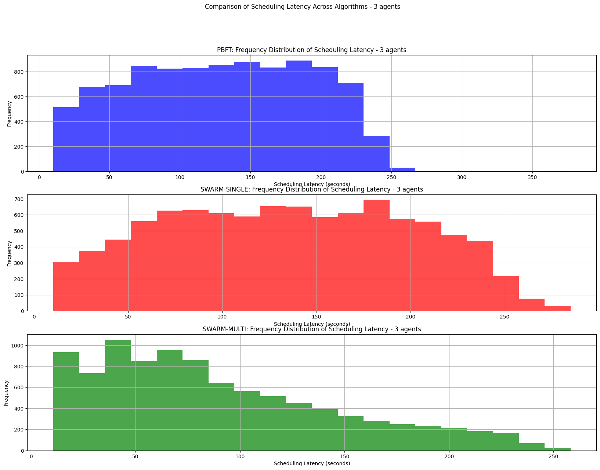
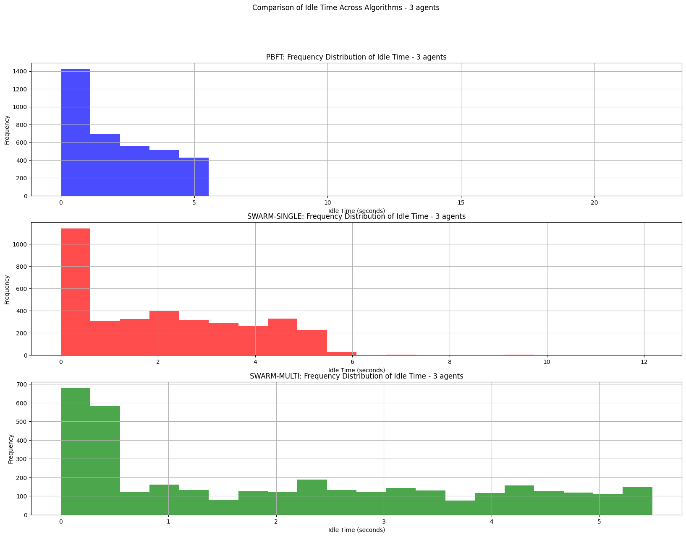
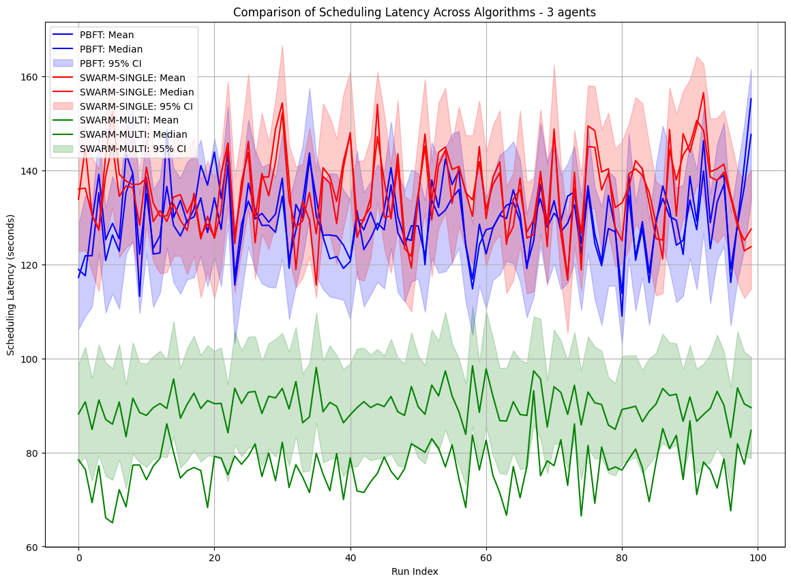
### Results with 5 Agents
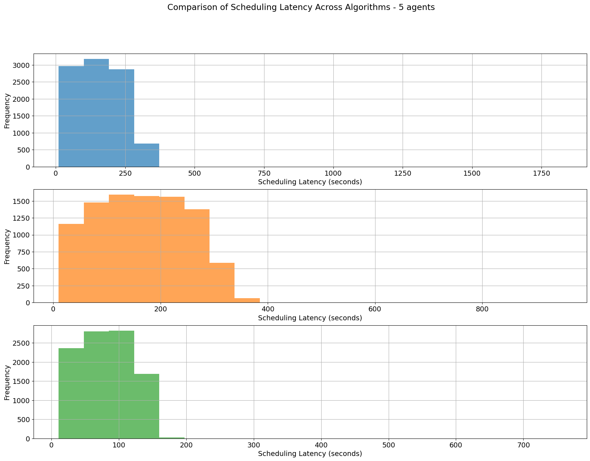
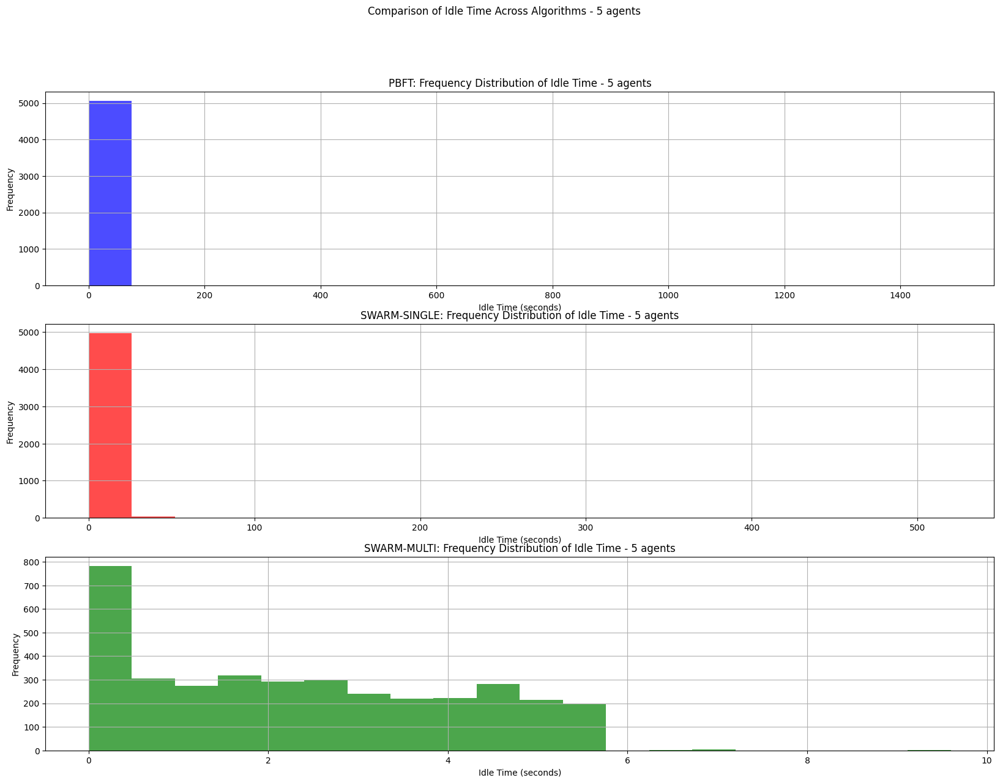
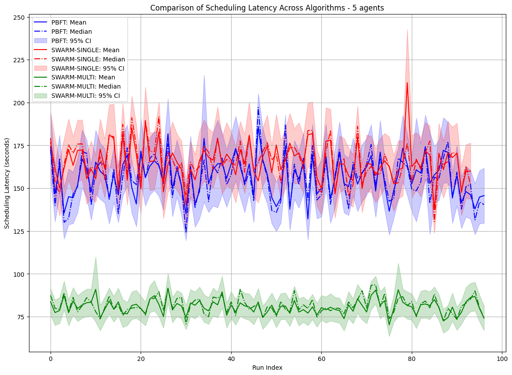

### Results with 10 Agents
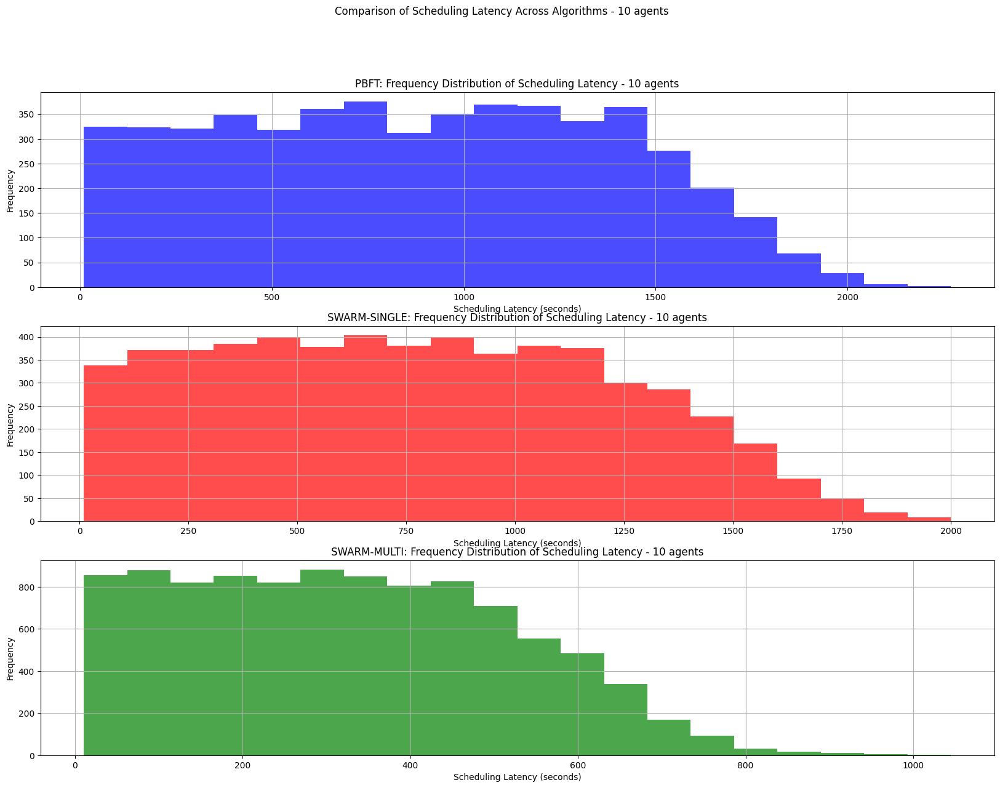
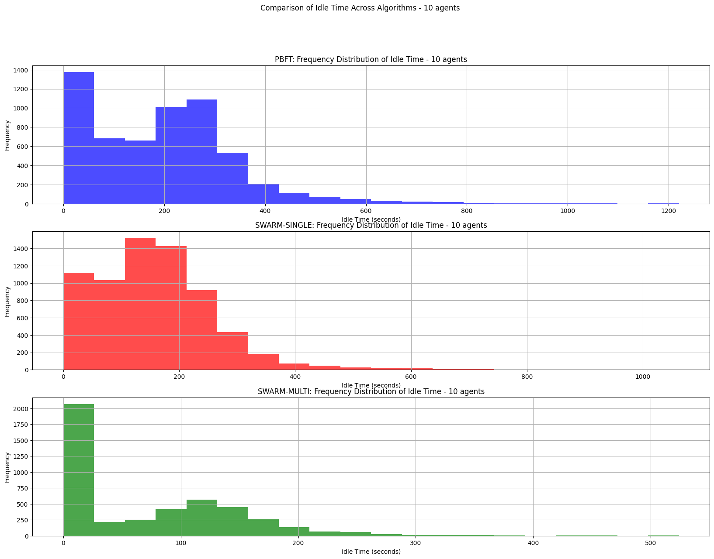
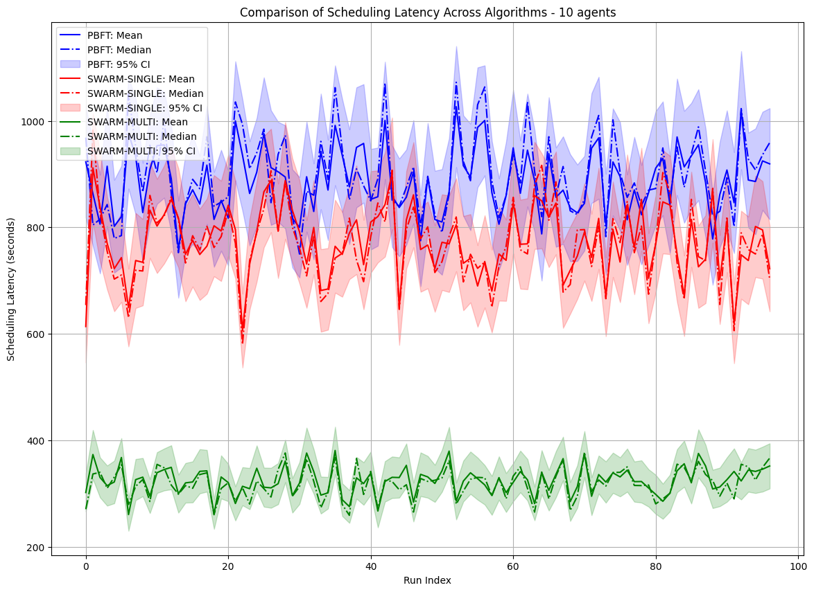

## Raft Consensus Algorithm
RAFT algorithm is explored and implemented in `raft_agent.py`. This agent works as follows:
### Single Leader Election:
A single leader is chosen based on the agent's load.
### Shared Job Queue
Job queue is maintained in Redis
### Job Scheduling:
The leader agent assigns the job to other agents based on their loads.
The leader agent schedules the job on itself if it can accommodate the job and its load is below a defined threshold.
### Leader Down:
If the leader fails, one of the followers assumes leadership and job scheduling continues
### Agent Termination Handling:
If an agent abruptly terminates while executing a job, the leader monitors the job's status.
If a job remains in a particular state beyond a specified threshold time, it is assumed to be terminated. The leader then moves the job to a Pending state for rescheduling.

### Usage
- Set up the python environment by installing all the dependencies:
```
pip install -r requirements.txt
```
- Bring up the kafka cluster using `docker-compose up -d`
- Generates `tasks.json` via `python task_generator.py`
- Start Agent 0 is started via following command:
```
   python3.11 main-raft.py 0 100
```
- Rest of the agents can be started via following command:
```
    sh raft-start.sh
```
NOTE: Remember to clean up the logs and kafka topic between runs via
```
rm -rf *.log*
python3.11 kafka_cleanup.py
```

### Performance
Scales well, handling large numbers of agents effectively.

Number of Agents: 10


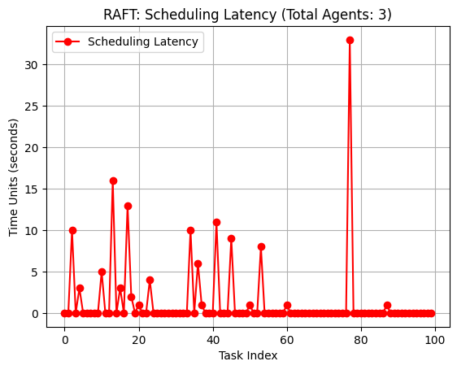
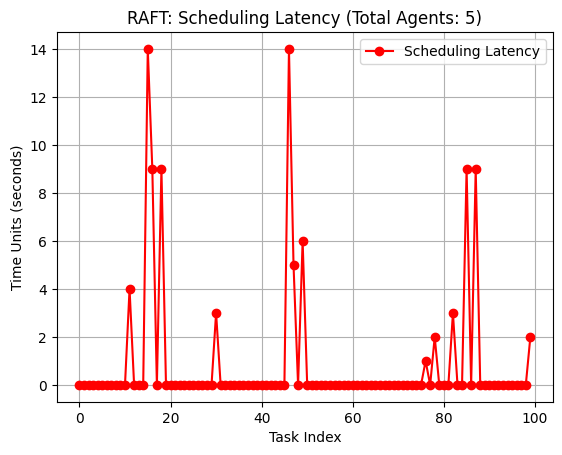
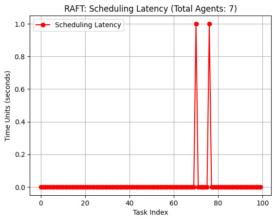

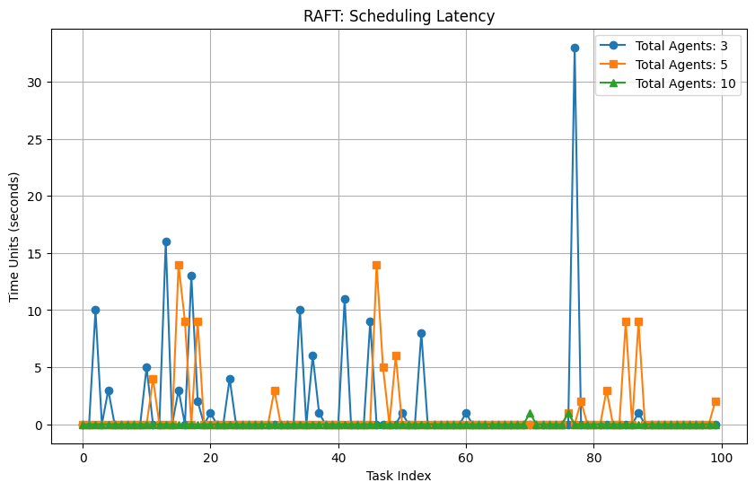
