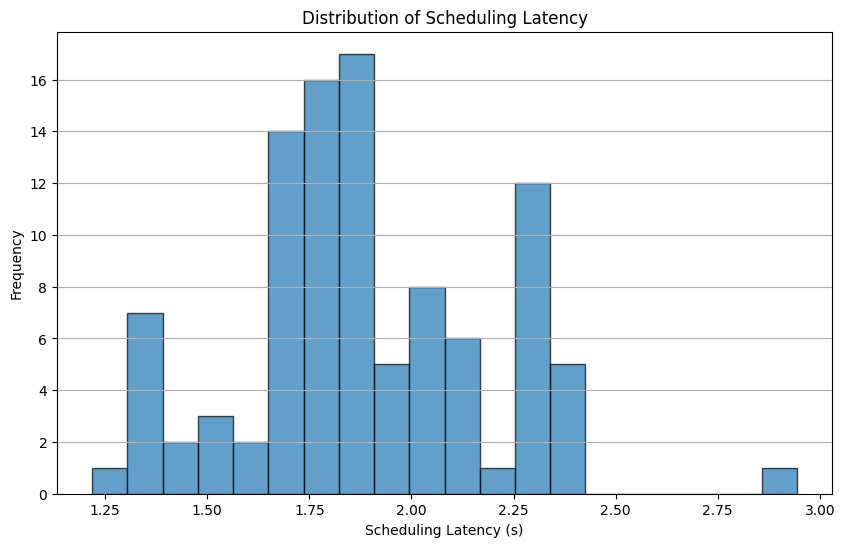
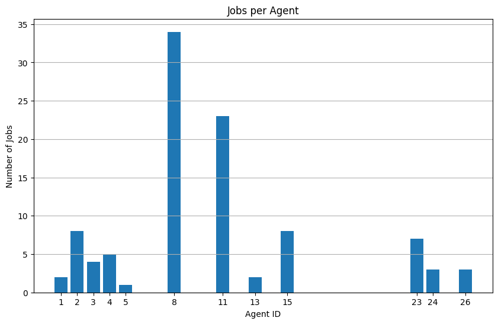
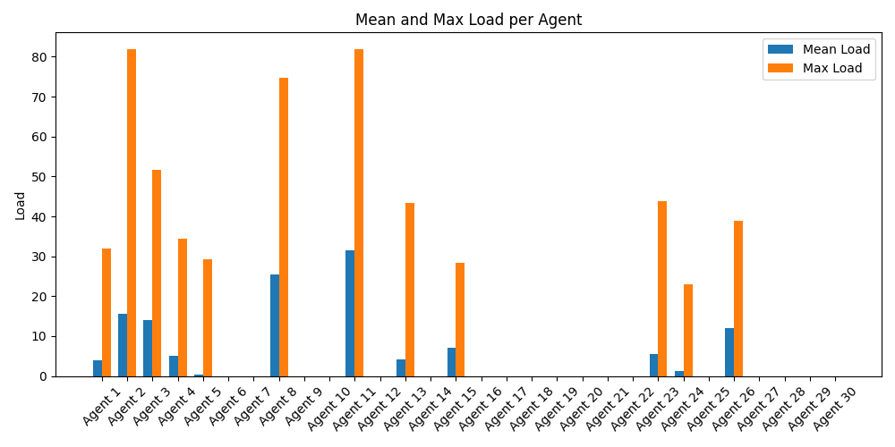
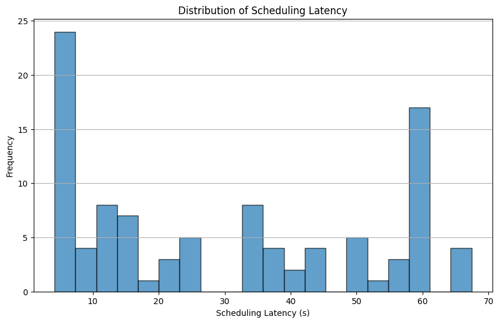
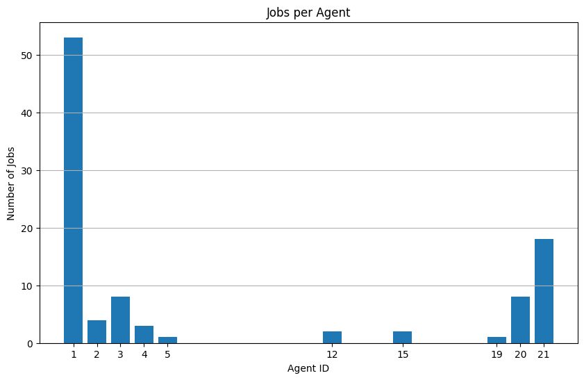
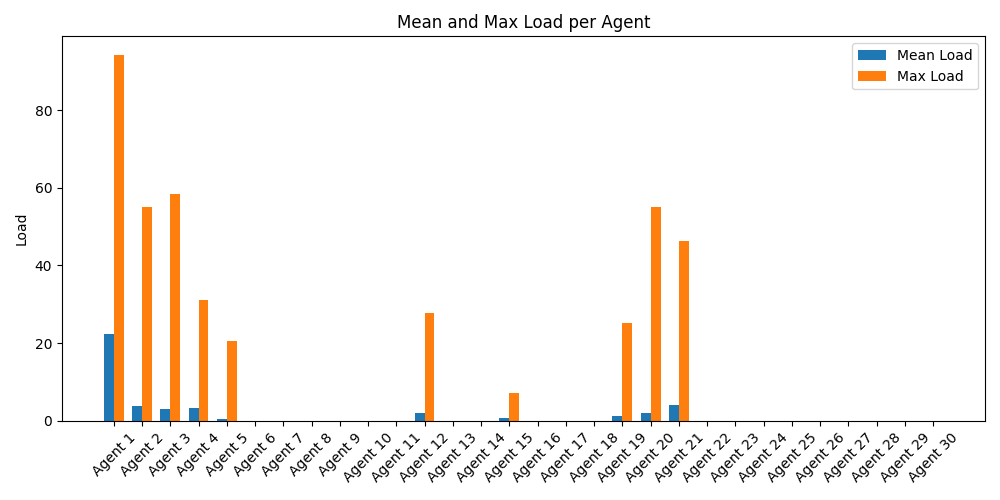
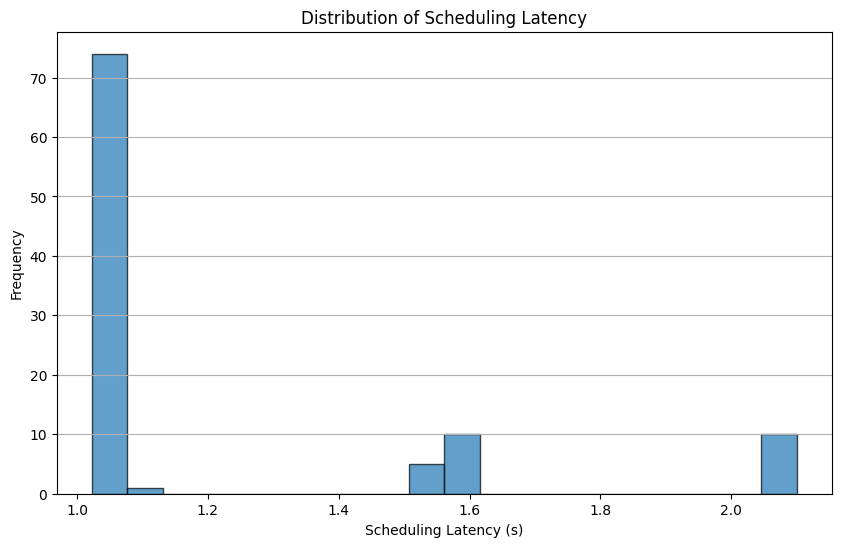
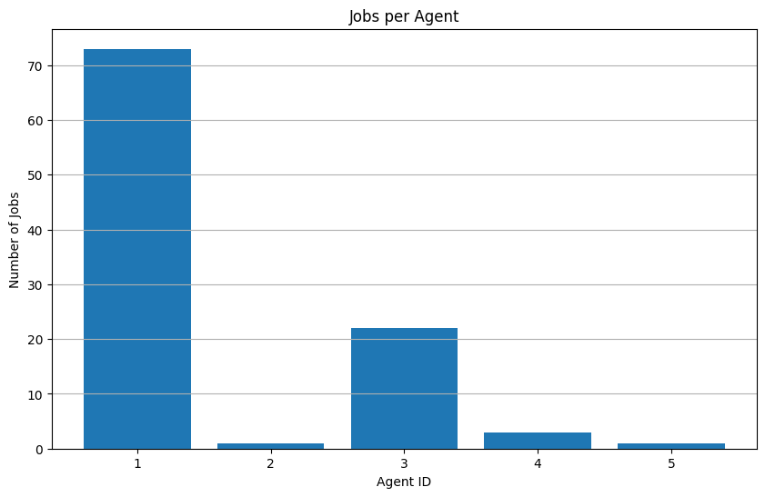
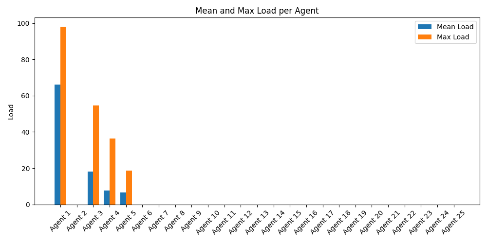

# SwarmAgents

This repository provides a framework for implementing greedy distributed consensus and selection algorithms. It is designed to support scalable, resilient, and efficient decision-making across multiple agents in a distributed system.

The core logic enables agents to reach consensus and make selections (such as job assignments) using PBFT-like protocols and cost-based selection strategies. The framework is modular, allowing for flexible integration of custom consensus, selection, and penalty mechanisms.

## Key Features
- Greedy distributed selection and consensus algorithms
- Modular design for consensus, selection, and penalty logic
- Example application for job selection
- Extensible for other distributed resource allocation problems


## Core Modules

### Consensus Engine (`consensus/engine.py`)
This module implements a generic PBFT-like consensus engine for distributed agreement among agents. It is framework-agnostic and uses host, transport, and router adapters for I/O and side effects. The engine manages proposals, prepares, and commits, allowing agents to reach agreement on object states (such as job assignments) through quorum-based rounds.

**How it works:**
- Agents initiate proposals for objects (e.g., jobs) and broadcast them to peers.
- Peers respond with prepare and commit messages, tracked by the engine.
- The engine checks for quorum and triggers selection or commit actions when consensus is reached.
- The engine is designed to be integrated with custom agent logic via adapter classes.

**How to use:**
- Instantiate `ConsensusEngine` with your agent's ID and adapter implementations for host, transport, and router.
- Use the `propose`, `on_proposal`, `on_prepare`, and `on_commit` methods to drive the consensus protocol.
- See `resource_agent.py` for a concrete example of integration.

### Selection Engine (`selection/engine.py`)
This module provides a generic, cache-enabled engine for assigning candidates (e.g., jobs) to assignees (e.g., agents/resources) based on feasibility and cost functions. It supports cost matrix computation, threshold-based selection, and memoization for performance.

**How it works:**
- Define feasibility and cost functions for your assignment problem.
- The engine computes a cost matrix for all candidate-assignee pairs, marking infeasible assignments with infinity.
- It selects the best assignee for each candidate using greedy or thresholded strategies, with optional tie-breaking and acceptance criteria.
- Internal LRU caches speed up repeated feasibility and cost checks.

**How to use:**
- Instantiate `SelectionEngine` with your feasibility and cost functions, plus key and versioning functions for candidates and assignees.
- Use `compute_cost_matrix` to build the assignment matrix, and `pick_agent_per_candidate` to select assignments.
- The engine is highly configurable for different selection policies and caching needs.

## Example: Job Selection

The file `swarm/agents/resource_agent.py` provides a comprehensive example of distributed job selection using both the consensus and selection engines:

### Cost Computation Equation

The cost for assigning a job to an agent is computed as a weighted sum of resource utilizations, plus penalties for long jobs and connectivity:

$$
	ext{cost} = w_{cpu} \cdot \text{CPU}_{util} + w_{ram} \cdot \text{RAM}_{util} + w_{disk} \cdot \text{Disk}_{util} + w_{gpu} \cdot \text{GPU}_{util} + \text{penalties}
$$

Where:
- $w_{cpu}$, $w_{ram}$, $w_{disk}$, $w_{gpu}$ are the weights for each resource (see `__init__` in `resource_agent.py`).
- Resource utilization terms are computed as the fraction of required over available capacity.
- Penalties include:
	- Long job penalty: applied if job execution time exceeds `long_job_threshold`.
	- Connectivity penalty: scaled by `connectivity_penalty_factor` for DTN jobs.

The final cost is used by the selection engine to compare candidate assignments and select the best agent for each job.

### Job Feasibility

Job feasibility determines whether an agent can execute a given job, based on its current resource capacities and the job's requirements. The logic is implemented in the `is_job_feasible` method of `resource_agent.py`.

**Feasibility criteria include:**
- The agent must have enough available CPU, RAM, Disk, and GPU resources to meet the job's requirements.
- The agent must satisfy any additional constraints, such as data dependencies or network connectivity (for DTN jobs).
- The method checks for resource overcommitment and ensures that jobs are only assigned to agents that can complete them successfully.

This feasibility check is performed before cost computation and candidate selection, ensuring that only valid agent-job pairs are considered in the assignment process.

### Cost Matrix and Candidate Selection

After feasibility is determined, the selection engine computes a cost matrix representing the assignment cost for each agent-job pair. This is handled by the `compute_cost_matrix` method of the `SelectionEngine` (see its instantiation and usage in `resource_agent.py`).

- **Cost Matrix:**
	- Each row corresponds to an agent, each column to a job.
	- Entries are the computed costs (see cost equation above), or infinity for infeasible assignments.
	- The matrix is built using the agent's current capacities, job requirements, and configured weights/penalties.

- **Candidate Selection:**
	- The selection engine uses the cost matrix to identify the best agent for each job, typically minimizing cost.
	- Selection can be thresholded using `selection_threshold_pct` to allow more flexible candidate pools.
	- Tie-breaking and acceptance criteria can be configured for custom selection policies.

This process ensures that jobs are assigned to agents in a way that balances resource usage, cost, and system constraints, as implemented in the selection logic of `resource_agent.py`.

### Distributed Consensus

Once candidate assignments are selected, agents use the consensus engine to coordinate agreement on job selection across the distributed system. This is implemented using a PBFT-like protocol in the `ConsensusEngine` (see its instantiation and usage in `resource_agent.py`).

- **Consensus Protocol:**
	- Agents broadcast proposals for job assignments to their peers.
	- Peers respond with prepare and commit messages, tracked by the consensus engine.
	- The engine checks for quorum (majority agreement) before finalizing job assignments.
	- Methods such as `__on_proposal`, `__on_prepare`, and `__on_commit` in `resource_agent.py` handle the protocol steps.

- **Fault Tolerance:**
	- The protocol ensures that job selection is robust to agent failures and network partitions.
	- Only when a quorum is reached does the system commit to a job assignment, maintaining consistency.

This distributed consensus mechanism allows agents to make autonomous decisions while ensuring global agreement and reliability in job scheduling.

### Job Execution
- **Execution & State Management:**
	- After consensus, jobs are scheduled and executed by the selected agents.
	- Job states and metrics are managed via methods like `schedule_job`, `execute_job`, and the `Metrics` class.


Additional implementation details:
- **Job Queue:** The job queue is managed using a Redis database, allowing agents to efficiently share and update job states in a distributed manner.
- **Message Exchange:** Agents communicate and exchange consensus/selection messages using gRPC, enabling fast and reliable messaging across the network.
- **Supported Topologies:** The framework supports various network topologies, including Ring, Mesh, and Hierarchical, which can be configured to match different deployment scenarios. Topology logic is handled via the `Topology` and `TopologyType` classes and used in agent initialization and routing decisions.

For implementation details, see:
- `resource_agent.py`: Integration of selection and consensus engines, job feasibility/cost logic, and scheduling workflow.
- `is_job_feasible`, `compute_job_cost`, and `SelectionEngine` usage for assignment logic.
- The weights and thresholds in the agent's `__init__` for tuning selection behavior.

### Testing

You can simulate all agents on a single host for testing and benchmarking. For example, to run 30 agents in a ring topology with 100 jobs and a local Redis database, use:

```bash
python run_test.py --agents 30 --topology ring --jobs 100 --db-host localhost --jobs-per-interval 10 --run-dir swarm-multi
```

This will launch the specified number of agents, distribute jobs, and store results in the `swarm-multi` directory. Adjust parameters as needed for your experiments.

### Results

Simulation results for different topologies (Ring, Mesh, Hierarchical, etc.) are stored in the `runs/simulation` directory. Each run contains logs, metrics, and output files summarizing agent performance, job completion rates, consensus rounds, and resource utilization.

- **How to interpret results:**
	- Compare job completion times, consensus latency, and resource usage across topologies.
	- Use the provided plotting scripts (see `plot_latency_jobs.py`) to visualize performance metrics.
	- Analyze logs for details on agent decisions, consensus events, and system behavior under different configurations.


### Example Results Visualizations

Below are example images showing results for different topologies:

**Mesh Topology:**






**Ring Topology:**






**Hierarchical Topology:**






For example, after running a simulation with `run_test.py`, inspect the corresponding results directory for summary files and plots. This helps evaluate the scalability, efficiency, and fault tolerance of the framework under various network structures.

