# SwarmAgents

A framework for greedy distributed consensus and selection algorithms, designed for scalable, resilient decision-making across multiple agents. Agents reach consensus on job assignments using a PBFT-like protocol with cost-based selection strategies.

## Table of Contents

- [Key Features](#key-features)
- [Core Modules](#core-modules)
- [Job Selection](#job-selection)
- [Network Topologies](#network-topologies)
- [Testing](#testing)
- [Results](#results)
- [Agent Failure Handling](#agent-failure-handling)
- [Dynamic Agent Addition](#dynamic-agent-addition)
- [Utilities](#utilities)
- [Additional Documentation](#additional-documentation)

## Key Features

- Greedy distributed selection and consensus algorithms
- PBFT-like consensus with cost-based self-selection and dominance filtering
- Multiple network topologies: Ring, Mesh, Star, Hierarchical
- LLM-enhanced agents (OpenAI/Ollama) alongside rule-based resource agents
- Multi-Armed Bandit (MAB) reinforcement learning for hierarchical delegation
- Agent failure detection, job reassignment, and dynamic agent addition
- Extensible for other distributed resource allocation problems

## Core Modules

### Consensus Engine (`swarm/consensus/engine.py`)

A generic PBFT-like consensus engine for distributed agreement. Framework-agnostic — uses host, transport, and router adapters for I/O and side effects.

- Agents broadcast proposals for objects (e.g., jobs) to peers
- Peers respond with prepare and commit messages, tracked by the engine
- Quorum-based rounds trigger selection or commit actions
- See `resource_agent.py` for integration via adapter classes

### Selection Engine (`swarm/selection/engine.py`)

A cache-enabled engine for assigning candidates to assignees based on feasibility and cost functions.

- Computes cost matrices for all candidate-assignee pairs (infeasible = infinity)
- Greedy or thresholded selection with tie-breaking and acceptance criteria
- Internal LRU caches for repeated feasibility and cost checks

## Job Selection

SwarmAgents implements distributed job selection through two agent variants:

- **ResourceAgent** — rule-based, computes feasibility and cost deterministically using configured weights and thresholds
- **LLMAgent** — LLM-enhanced, leverages a language model to evaluate and explain job-selection decisions

Both share the same consensus, selection, and topology logic.

### Cost Computation

#### Resource Agent

$$
\text{cost} = w_{cpu} \cdot \text{CPU}_{util} + w_{ram} \cdot \text{RAM}_{util} + w_{disk} \cdot \text{Disk}_{util} + w_{gpu} \cdot \text{GPU}_{util} + \text{penalties}
$$

- Weights dynamically adjust per job type (CPU-intensive, memory-heavy, DTN/data-transfer, etc.)
- Penalties: long job penalty (`long_job_threshold`), connectivity penalty (`connectivity_penalty_factor`)
- See `compute_job_cost` in `resource_agent.py`

#### LLM Agent

Each LLM agent independently evaluates jobs using LLM reasoning, producing a single-column cost view per agent. This decentralized approach reduces inter-agent overhead while incorporating contextual reasoning.

### Job Feasibility

Both agents perform a feasibility check before cost computation:
- Sufficient CPU, RAM, Disk, GPU capacity
- DTN connectivity for data-dependent jobs
- Resource overcommitment prevention

For LLMAgent, feasibility remains deterministic; only cost ranking uses LLM input.

### Cost Matrix and Selection

The selection engine builds a cost matrix (agents x jobs), then selects the minimum-cost agent per job. Selection is thresholded via `selection_threshold_pct` to control the candidate pool.

### Consensus Protocol

1. Agents broadcast proposals for job assignments
2. Peers respond with prepare and commit messages
3. Quorum reached (`ceil((n+1)/2)`) finalizes assignment
4. Dynamic quorum adjusts based on live agent count

See [message_complexity.md](message_complexity.md) for detailed message complexity analysis.

### Job Execution

After consensus, jobs are scheduled and executed by selected agents. States and metrics are managed via Redis and the `Metrics` class. Communication uses gRPC for inter-agent messaging.

## Network Topologies

### Ring
Circular structure where agents communicate with immediate neighbors. Minimizes communication overhead; higher latency for distant consensus. Best for 10-50 agents.

### Mesh
Fully connected network. Fastest consensus but highest communication overhead. Best for 5-30 agents and benchmarking.

### Star
Central coordinator communicates with all agents. Simple coordination but single point of failure. Best for small deployments with a clear leader.

### Hierarchical

Multi-level tree with parent-child relationships for scalable coordination:
- **Level 0 (Leaf agents)**: Workers organized into groups (5-10 per group)
- **Level 1+ (Coordinators)**: Parent agents that coordinate groups

Supports mixed agent types (LLM coordinators + Resource workers), co-parent failover, and MAB-based delegation.

| Agents | Tiers | Job Entry Level | Flow |
|--------|-------|-----------------|------|
| 30, 110 | 2-tier | Level 1 | L1 -> L0 |
| 100, 1000 | 3-tier | Level 2 | L2 -> L1 -> L0 |

See detailed guides:
- [HIERARCHICAL_LLM_AGENTS.md](HIERARCHICAL_LLM_AGENTS.md) — LLM/Resource agent mixing
- [CO_PARENT_USAGE.md](CO_PARENT_USAGE.md) — Multi-parent shared parenting and failover
- [MAB_README.md](MAB_README.md) — Multi-Armed Bandit delegation for hierarchical topologies

## Testing

### Prerequisites

```bash
pip install -r requirements.txt
docker run -d -p 6379:6379 redis
```

### Resource Agents

```bash
# Single-host test (30 agents, ring, 100 jobs)
python run_test.py --agents 30 --topology ring --jobs 100 --db-host localhost --jobs-per-interval 10 --run-dir runs/test-001

# Advanced test runner (local mode)
python run_test_v2.py --mode local --agent-type resource --agents 20 --topology mesh --jobs 500 --db-host localhost --run-dir runs/v2-test

# Remote mode (multiple hosts, requires passwordless SSH)
python run_test_v2.py --mode remote --agent-type resource --agents 30 --agents-per-host 5 --topology ring --jobs 1000 --db-host 10.0.0.5 --agent-hosts-file hosts.txt --run-dir runs/remote-test
```

### LLM Agents

```bash
# OpenAI
export OPENAI_API_KEY=sk-xxxx
python run_test.py --agent-type llm --agents 10 --topology mesh --jobs 200 --db-host localhost --jobs-per-interval 20 --run-dir runs/llm-001

# Ollama
export LLM_BASE_URL=http://localhost:11434/v1
python run_test.py --agent-type llm --agents 5 --topology ring --jobs 100 --db-host localhost --jobs-per-interval 10 --run-dir runs/llm-002
```

### Batch Testing

```bash
python batch_tests_v2.py --runs 10 --base-out runs/batch --mode local --agent-type resource --agents 20 --topology mesh --jobs 500 --db-host localhost
```

### Visualizations

```bash
python plot_latency_jobs.py --output_dir runs/test-001 --agents 30 --db_host localhost [--hierarchical]
```

Generated plots include scheduling latency histograms, jobs per agent, agent load summaries, and (with `--hierarchical`) topology visualizations, agent type comparisons, and LLM overhead analysis.

## Results

**Evaluation Data** for **SWARM(CCGrid'25)** and **SWARM+(CCGrid'26)** can be found [here](https://github.com/swarm-workflows/swarm-evaluation-data).

### Example Visualizations

#### Resource Agents — Mesh Topology
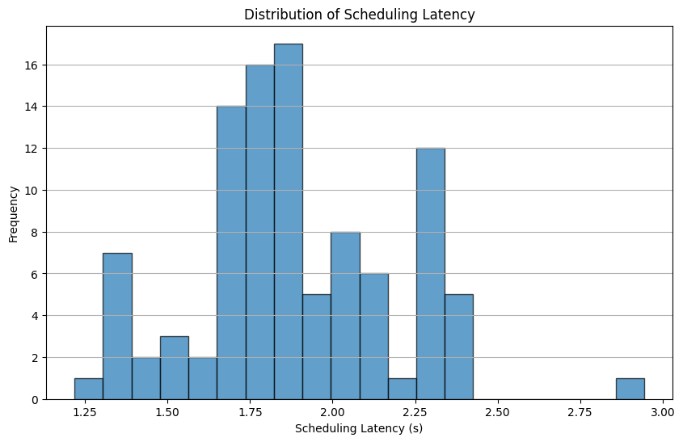
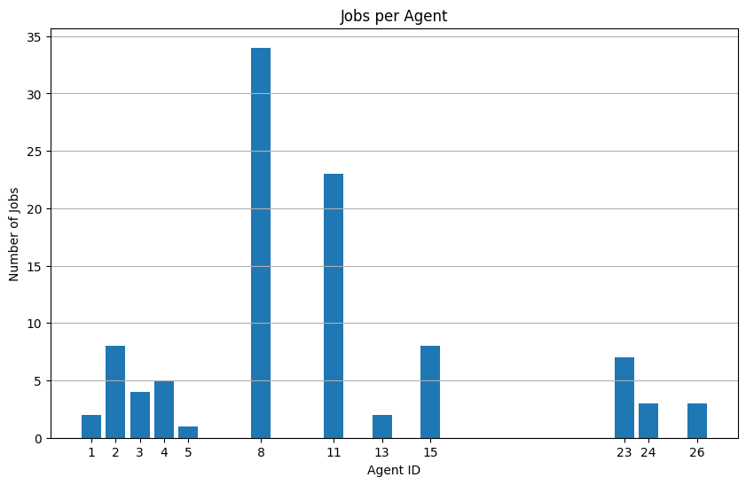
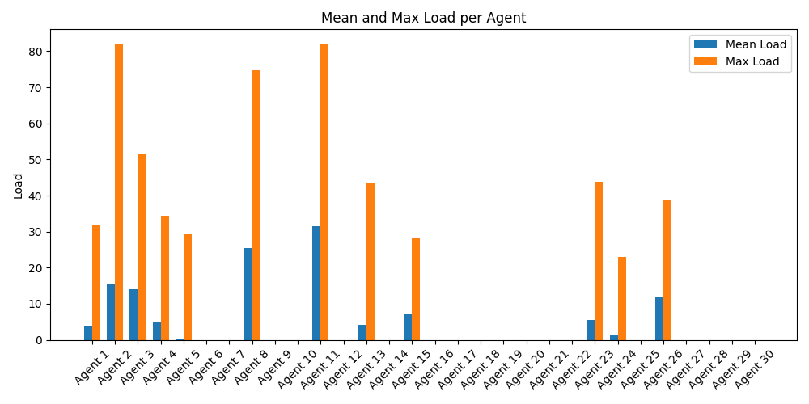

#### Resource Agents — Ring Topology
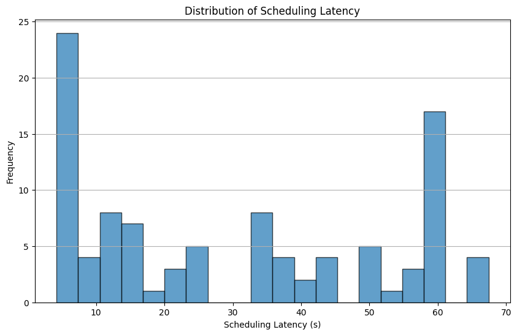
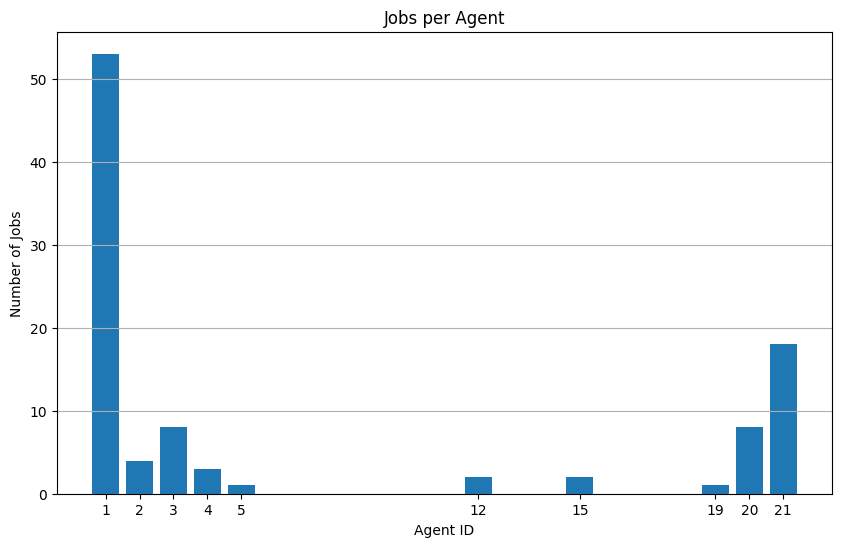
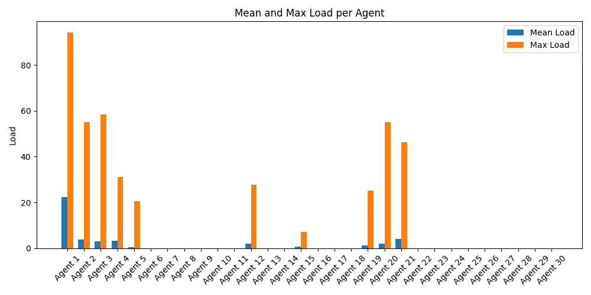

#### Resource Agents — Hierarchical Topology
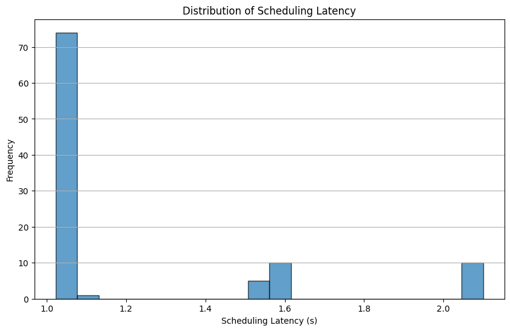
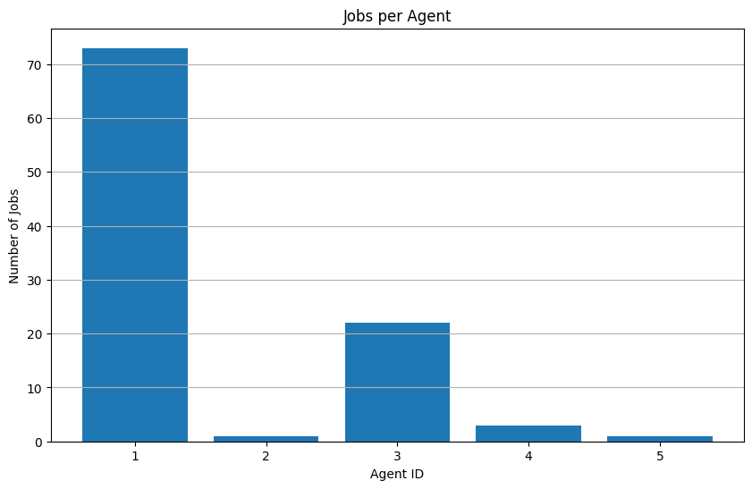
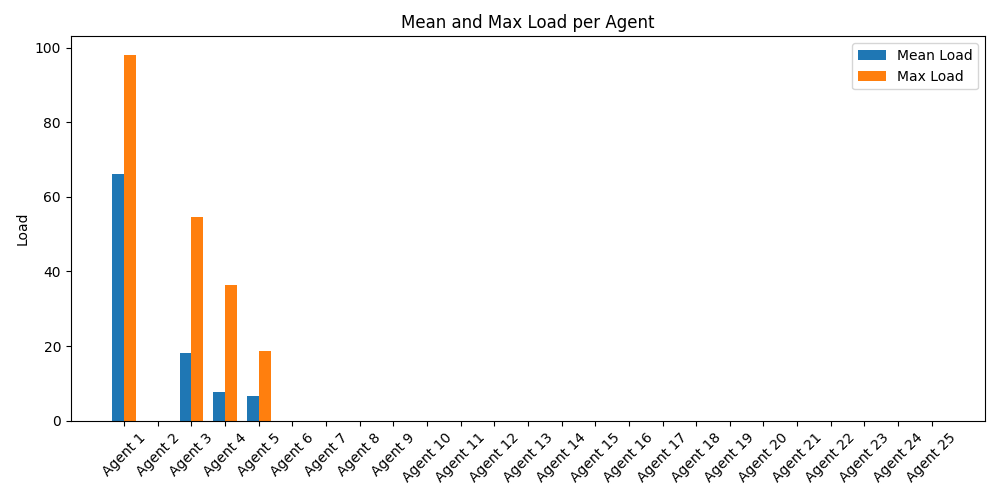

#### LLM Agents — Mesh Topology
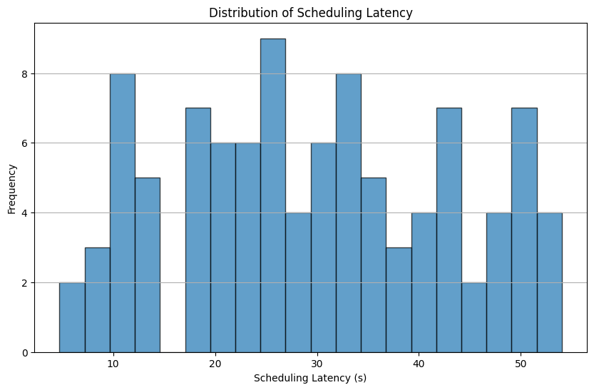
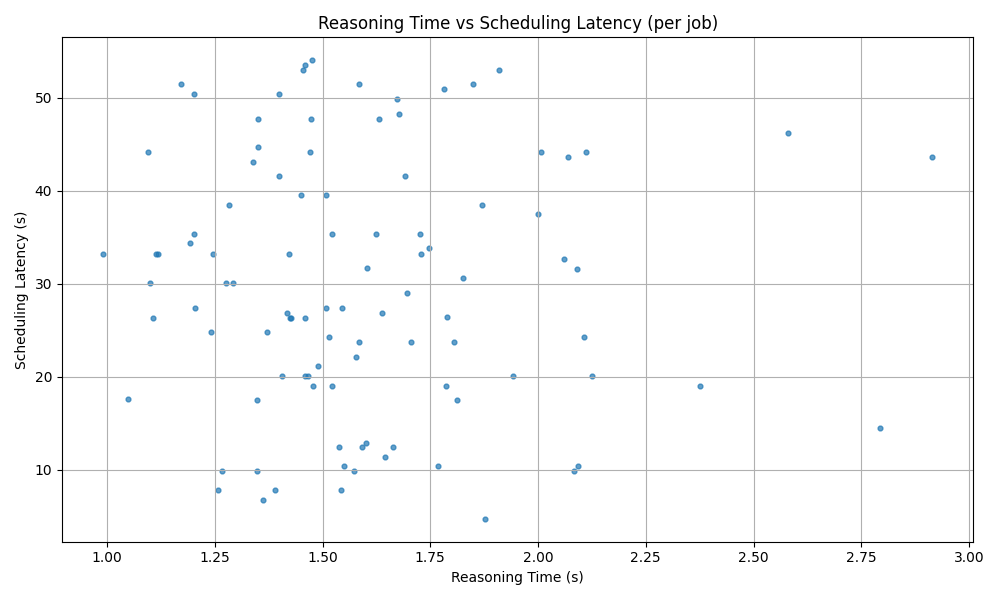
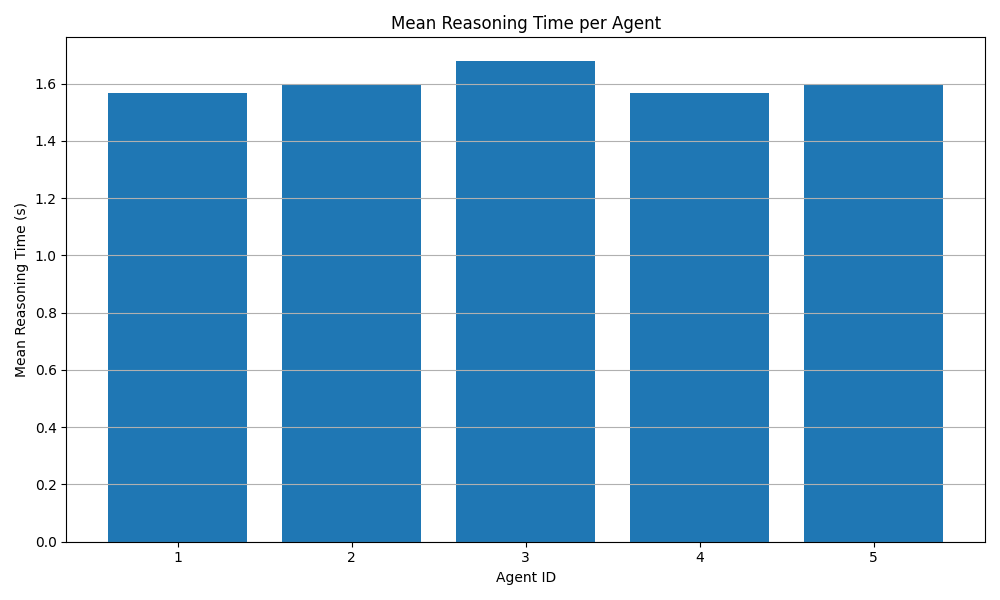
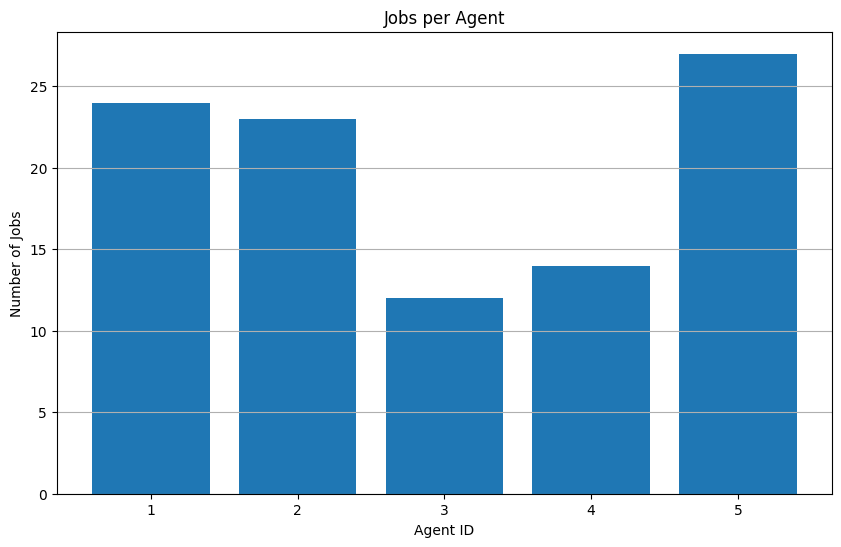
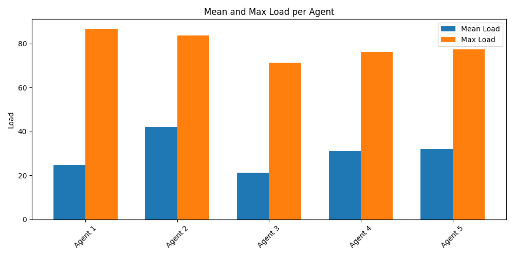

## Agent Failure Handling

### Detection Mechanisms

1. **Peer Expiry** — Agents not updating within `peer_expiry_seconds` (default: 300s) are marked stale
2. **gRPC Health Checking** — Channel-down events trigger peer status callbacks
3. **Job Reselection Timeout** — Jobs stuck in PREPARE/COMMIT beyond `reselection_timeout_s` (default: 60s) reset to PENDING
4. **Dynamic Quorum** — `quorum = (live_agents // 2) + 1`, adjusts as agents fail

### Configuration

```yaml
runtime:
  peer_expiry_seconds: 300
  reselection_timeout_s: 60
  failure_threshold_seconds: 30
  max_failed_agents: 10
  job_reassignment_enabled: true
```

### Simulating Failures

```bash
python kill_agents.py --mode local --count 1 --random           # Single failure
python kill_agents.py --mode local --count 10 --interval 30 --random  # Cascading
python kill_agents.py --mode local --count 7 --random           # Catastrophic (25%)
```

### Monitoring

```bash
grep "RESTART: Job" <run-dir>/agent-*.log
grep "Agent.*detected as FAILED" <run-dir>/agent-*.log
```

## Dynamic Agent Addition

Add agents during execution via three trigger types:

```bash
# Time-based: add 5 agents after 30 seconds
python run_test_v2.py --mode local --agents 20 --dynamic-agents 5 \
    --dynamic-trigger time --dynamic-delay 30 \
    --topology mesh --jobs 500 --db-host localhost --run-dir runs/dynamic-time

# Bucket-based: add agents when Redis bucket reaches threshold
python run_test_v2.py --mode local --agents 20 --dynamic-agents 10 \
    --dynamic-trigger bucket --dynamic-trigger-bucket 1 --dynamic-trigger-threshold 50 \
    --topology ring --jobs 500 --db-host localhost --run-dir runs/dynamic-bucket

# Job-completion-based: add agents after N jobs complete
python run_test_v2.py --mode local --agents 15 --dynamic-agents 5 \
    --dynamic-trigger jobs-completed --dynamic-trigger-jobs 100 \
    --topology hierarchical --jobs 300 --db-host localhost --run-dir runs/dynamic-jobs
```

Dynamic agents are pre-configured, started when the trigger fires, and join the topology via Redis peer discovery.

## Utilities

| Script | Purpose |
|--------|---------|
| `job_generator.py` | Generate synthetic job descriptions matching agent profiles |
| `generate_configs.py` | Create agent configs for different topologies and agent counts |
| `job_distributor.py` | Distribute jobs to Redis at a controlled rate |
| `dump_db.py` | Inspect Redis database state for debugging |
| `kill_agents.py` | Simulate agent failures (local/remote, gradual/instant) |
| `plot_latency_jobs.py` | Visualize scheduling latency, load, and failure metrics |
| `plot_mab_results.py` | Visualize MAB learning curves and delegation patterns |
| `plot_comparison.py` | Compare results across multiple runs |
| `analyze_run.py` | Post-run analysis of metrics and agent behavior |

Run any script with `--help` for full usage details.

## Additional Documentation

- [HIERARCHICAL_LLM_AGENTS.md](HIERARCHICAL_LLM_AGENTS.md) — LLM agents as Level 1 coordinators in hierarchical topology
- [CO_PARENT_USAGE.md](CO_PARENT_USAGE.md) — Multi-parent shared parenting for hierarchical failover
- [MAB_README.md](MAB_README.md) — Multi-Armed Bandit configuration and tuning for delegation
- [message_complexity.md](message_complexity.md) — PBFT message complexity analysis
