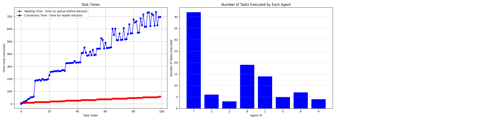

# SwarmAgents-Consensus

This repository hosts code for emulating SWARM agents and investigating different consensus algorithms concerning task scheduling among the agents.

## Practical Byzantine Fault Tolerance (PBFT)
PBFT algorithm is explored and implemented in `pbft_agent.py`. This agent works as follows:

- Each agent has a copy of the task Queue
- Collaborative decision-making by agents to determine tasks for scheduling taking into account the following factors:
  - Dependencies of tasks on data
  - Resource requirements specified by a task
  - Agent’s own resources
  - Neighbor’s load status
- Inter Agent messaging is done over kafka using broadcast messaging
- Agents exchange their load information via Heartbeat messages
- Each agent attempts to be a leader to execute a task based on following conditions:
  - Has enough resources for the task
  - Has access to any of the data dependencies of the task
  - Has load lesser than all its neighbors
- If all the above conditions are met, agent sends Proposal to be a leader to every other agent in the network.
- Each Proposal also has a seed value which is a random value generated between 0 and 1
- Proposal collision is resolved by choosing an agent with the lowest
- After a Proposal is sent, agent waits to receive Prepare messages indicating the acceptance of the proposal.
- If quorum count of Prepares are received, agent sends Commit messages to everyone in the network indicating leader election.
- If quorum count of Commits are received, agent finalizes leader election, at this point the task is scheduled and executed.

### Task State Machine
- The task's state transitions are influenced by message exchanges. 
- Agents are vying to become leaders for tasks. 
- Once a consensus is established and a leader is elected, the leading agent can proceed to execute the task. 
- Agents may concurrently participate in leader elections for multiple tasks.

NOTE: Only tasks in Pending state are picked by an agent for scheduling.

#### Initiator Agent


#### Participant Agent


### Agent Architecture


### Performance
PBFT consensus works with smaller number of agents but struggles to scale efficiently as the number of agents increases, due to its communication complexity.
However, it's resilient and fault tolerant.

- **Scenario 1: Number of tasks: 100, Number of Agents: 10**


 - **Scenario 2: Number of tasks: 500, Number of Agents: 5**


### Usage
1. Setup the python environment by installing all the dependencies:
```
pip install -r requirements.txt
```
2. Bring up the kafka cluster using `docker-compose up -d`
3. Generates `tasks.json` via `python task_generator.py`
4. Launch the agents via `sh start.sh`. User can increase the number of agents within `start.sh`

## Raft Consensus Algorithm
**TODO** - work in progress
